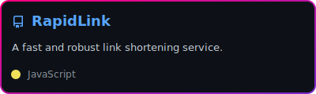
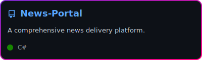
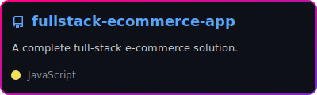
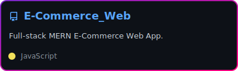
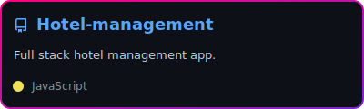
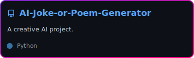

  

 

  

  &nbsp;
  

 

### 👨🏻‍💻 About Me

💡 I am a B.Sc. (Hons) in Computer Science undergraduate and an aspiring software engineer with a passion for building efficient, scalable, and meaningful software.  
🌱 My interests are centered around **AI, innovation, and solving real-world problems** through practical technology.  
💼 I enjoy combining technical thinking with a business and marketing mindset to create solutions that are both useful and impactful.  

-----

  

  
  
   
   
  
  
   
   
  
  

 

  

  

     &nbsp;
     &nbsp;
     &nbsp;
     &nbsp;
     &nbsp;
     &nbsp;
     &nbsp;
     &nbsp;
     &nbsp;
     &nbsp;
     &nbsp;
     &nbsp;
     &nbsp;
     &nbsp;
     &nbsp;
  

-----

  

  

 

  
  

 

-----

  <h3>📫 Let's Connect!</h3>
   &nbsp;
   &nbsp;
  

